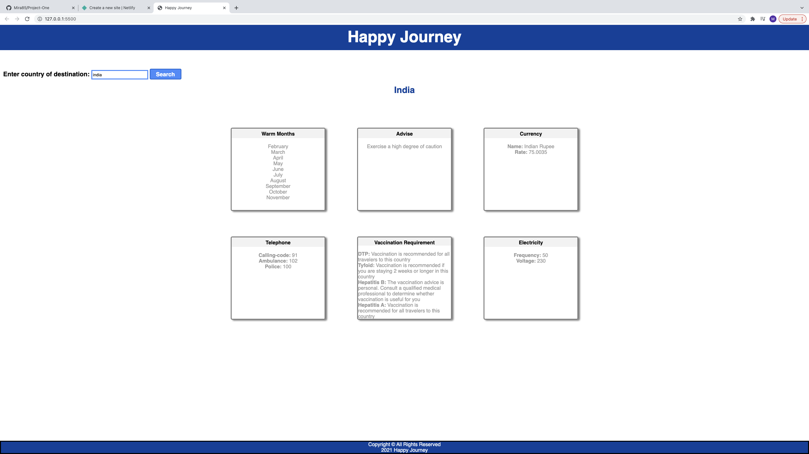

# Happy Journey

This web application provides important travel related information for any country in the world. It provides months with warm temperatures, requirement for vaccinations to visit the country, and information on currency and electricity.

## Technologies Used

- HTML5
- CSS3
- Javascript/JQuery
- Travelbriefing API

## Screenshots

## Getting started

[Click Here](https://happy-journey.netlify.app/) to see the deployed app!

## Future Enhancements

- Have a drop down menu for countries. Possible source of data can be from this API: http://api.worldbank.org/v2/country.
- User can store their favorite destination to localstorage.
